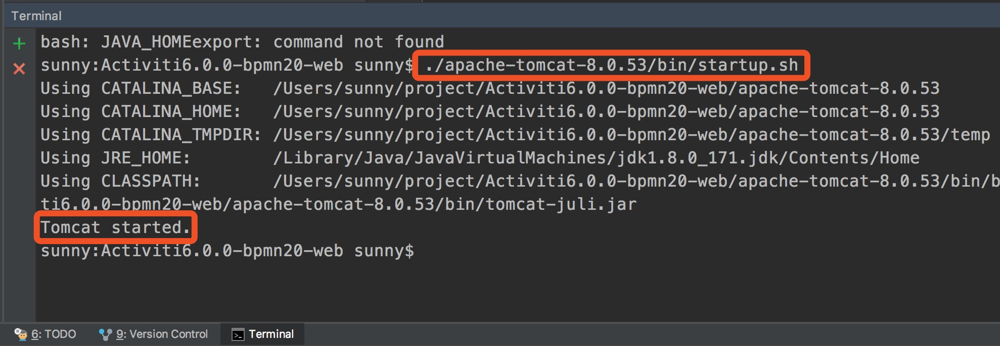
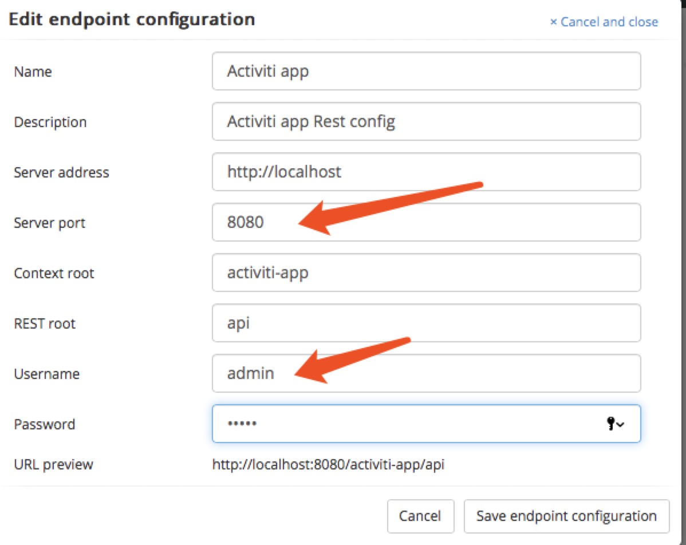
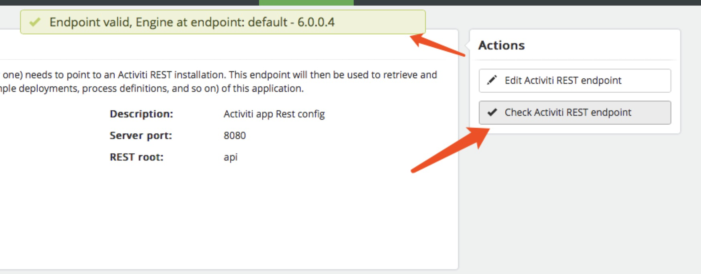
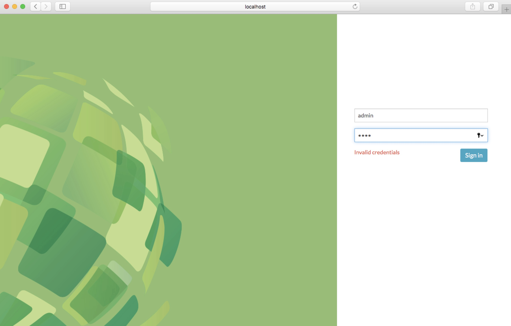
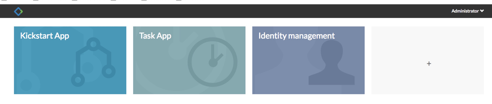
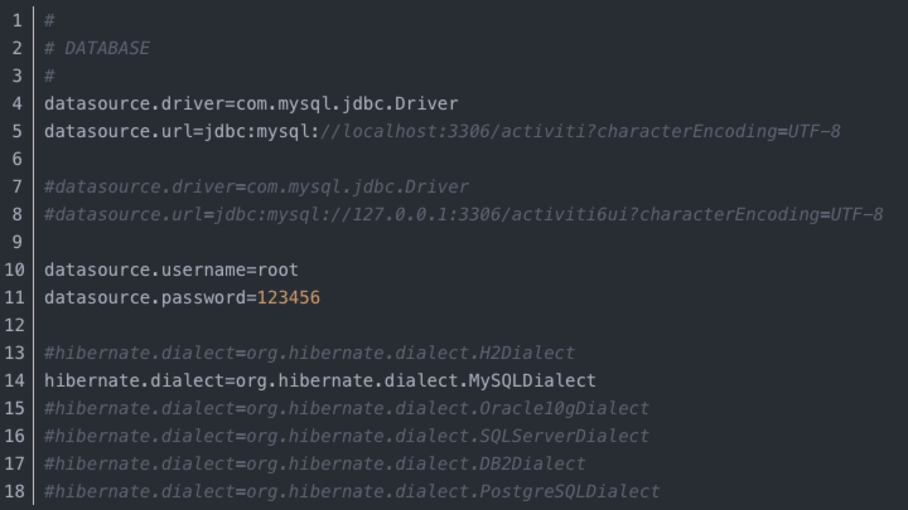

# Activiti6.0.0工作流引擎的web程序设计器


### Activiti6.0.0 Web在线流程设计器环境搭建：

1. 首先在[Activiti](https://www.activiti.org/)官网下载activiti6.0.0
2. 然后下载[Tomcat8.0.53](http://mirror.bit.edu.cn/apache/tomcat/)
3. 最后把activiti-6.0.0/wars/activiti-admin.war 和 activiti-6.0.0/wars/activiti-app.war放到tomcat的webapp目录下


Activiti6.0.0-bpmn20-web是我搭建好的Web流程设计器，可以直接克隆项目启动，并在线设计工作流引擎流程图
```
git clone clone https://github.com/gaoshengnan/Activiti6.0.0-bpmn20-web.git
```
之后打开Terminal



启动Tomcat之后访问
[http://localhost:8080/activiti-admin](http://localhost:8080/activiti-admin)

> Username：admin   
  Password：admin
  
这里默认的Server port是9999，修改端口号为8080，并设置app的密码为test

点击【Check Activiti Rest endpoint】测试一下

然后访问[http://localhost:8080/activiti-app](http://localhost:8080/activiti-app)


> Username：admin   
  Password：test
  

  
然后就可以开始设计流程图了～～～

### 注意
activiti默认配置h2的数据库，如果重新启动Tomcat，设计好的流程图就被清空了，我们可以配置成自己的mysql数据库

然后修改这个路径下的配置：

apache-tomcat-9.0.13/webapps/activiti-app/WEB-INF/classes/META-INF/activiti-app/activiti-app.properties



